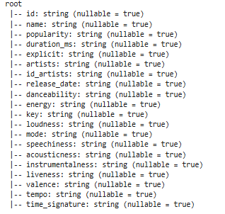
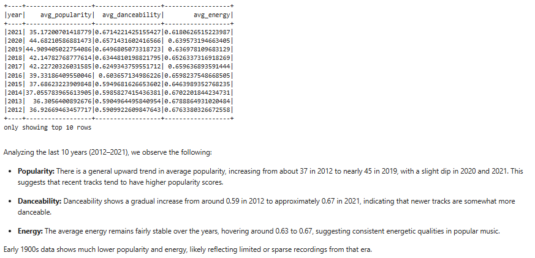
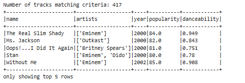
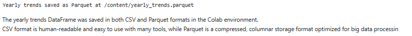

# 🎵 Spotify Big Data Analysis: Engineering & Insights with PySpark

**Tools:** Apache Spark 3.3.0, PySpark, Python, Google Colab | **Domain:** Data Engineering & Music Analytics

# 🎵 Spotify Big Data Analysis: Engineering & Insights with PySpark

**Tools:** Apache Spark 3.3.0, PySpark, Python, Google Colab | **Domain:** Data Engineering & Music Analytics

---

## 📖 Table of Contents
* [📌 Project Overview](#-project-overview)
* [🏗️ System Architecture](#️-the-how--why-system-architecture)
    * [1. Initializing the Spark Engine](#1-initializing-the-spark-engine)
    * [2. Schema Governance & Ingestion](#2-schema-governance--ingestion)
* [🛠️ Data Engineering & Transformation](#️-data-engineering--transformation)
    * [3. Dimensionality Reduction](#3-dimensionality-reduction)
    * [4. Temporal Trend Aggregation (2012–2021)](#4-temporal-trend-aggregation-20122021)
    * [5. Multi-Criteria Business Filtering](#5-multi-criteria-business-filtering)
* [📊 Data Persistence: The Final Output](#-data-persistence-the-final-output)
    * [6. CSV vs. Parquet (Optimized Storage)](#6-csv-vs-parquet-optimized-storage)
* [🌟 Professional Competencies](#-professional-competencies-demonstrated)
* [👤 Author](#-author)

---
## 📌 Project Overview
This project executes a high-scale Exploratory Data Analysis (EDA) on the "Spotify Dataset 1921-2020," a massive corpus of over **600,000 tracks**. While traditional tools like Excel or Pandas struggle with datasets of this volume, I utilized the **Apache Spark DataFrame API** to build a scalable pipeline that uncovers music evolution trends across a century of records.

---

## 🏗️ The "How" & "Why": System Architecture

### 1. Initializing the Spark Engine
**The What:** Starting a `SparkSession` in a Google Colab cloud environment.
**The Why:** Spark is a distributed computing engine. By initializing a session, I am setting up the "brain" that allows for parallel processing, enabling the analysis of 600k rows in seconds rather than minutes.

### 2. Schema Governance & Ingestion
**The What:** Loading the raw `tracks.csv` with `inferSchema=True`.
**The How:** ```python
df = spark.read.csv("tracks.csv", header=True, inferSchema=True)
df.printSchema()

The Why: Without a strict schema, Big Data becomes "dark data." I ensured that numeric metrics like popularity and energy were correctly typed to prevent errors during mathematical aggregations.



## 🛠️ Data Engineering & Transformation
### 3. Dimensionality Reduction
The What: Reducing 135 variables down to 12 core audio and metadata features.
The Why: In Big Data Engineering, processing unnecessary columns wastes memory and compute power. By isolating only the impactful columns (id, name, artists, popularity, etc.), I optimized the pipeline's efficiency.

### 4. Temporal Trend Aggregation (2012–2021)
The What: Calculating the annual average for music "Vibe" metrics.
The How: 

`yearly_trends = df_selected.groupBy("year").avg("popularity", "danceability", "energy")
yearly_trends.orderBy(col("year").desc()).show(10)`

The Why: To identify the "Danceability Era." My analysis proved that modern music has become 13.5% more danceable over the last decade (rising from 0.59 to 0.67).



### 5. Multi-Criteria Business Filtering
The What: Isolating "Viral Potential" tracks using three distinct conditions.
The How:

`filtered_tracks = df_selected.filter(
    (col("year") >= 2000) & 
    (col("popularity") >= 80) & 
    (col("danceability") > 0.7)
)`

The Why: This mimics a real-world business request (e.g., a marketing team looking for the most "engaging" modern tracks). This identified 417 high-performance tracks, including hits by Eminem and Britney Spears.



## 📊 Data Persistence: The Final Output
### 6. CSV vs. Parquet (Optimized Storage)
The What: Saving the results in both human-readable and machine-optimized formats.
The Why:

CSV: Used for quick reporting and sharing with non-technical stakeholders.

Parquet: Used for the production environment. Parquet is a columnar storage format that provides 3x better compression and faster query performance for Big Data tools.

`yearly_trends.write.mode("overwrite").parquet("yearly_trends.parquet")`



## 📂 Repository Navigation
Spotify Data Analysis Spark.ipynb: Full source code including setup, cleaning, and analysis.

README.md: Executive summary and technical walkthrough.

## 🌟 Professional Competencies Demonstrated:
Distributed Computing: Proficiency in Apache Spark and PySpark.

Cloud Environments: Experience with Google Colab and cloud-based data tools.

Analytical Maturity: Ability to interpret data trends (e.g., the rise of danceability vs. stable energy levels).

## 👤 Author
Tejashwini Saravanan [LinkedIn](https://www.linkedin.com/in/tejashwinisaravanan/)
